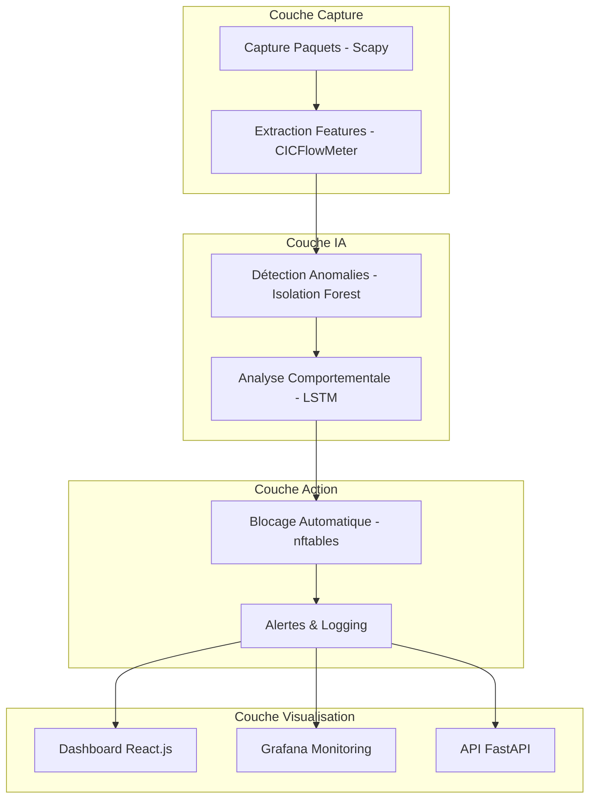

```markdown
# 🔥 NGFW Congo - Pare-feu Nouvelle Génération avec IA Comportementale

**Un pare-feu autonome et intelligent conçu pour la détection proactive des cybermenaces dans les réseaux d'entreprise, spécialement adapté au contexte Africain.**

---

## 🎯 Fonctionnalités Principales

### 🤖 Intelligence Artificielle
- **Détection comportementale** avec Isolation Forest et LSTM
- **Apprentissage continu** et adaptation aux nouvelles menaces
- **Analyse proactive** des anomalies réseau en temps réel
- **Détection zero-day** sans dépendance aux signatures

### 🛡️ Sécurité Avancée
- **Blocage automatique** des IP malveillantes via nftables
- **Inspection approfondie** des paquets (couche 2-7)
- **Détection multi-couches** (réseau, transport, application)
- **Gestion des faux positifs** avec feedback humain

### 📊 Monitoring Enterprise
- **Dashboard React.js** temps réel
- **Intégration Grafana** pour le monitoring avancé
- **Export de logs** vers SIEM (CEF, Syslog)
- **API REST complète** pour l'intégration

### 🌍 Contexte Local
- **Optimisé pour les ressources limitées**
- **Adapté aux infrastructures Africaines**
- **Solution souveraine** et indépendante
- **Documentation en Français**

---

## 🏗️ Architecture du Système



---

## 🚀 Installation et Déploiement

### Prérequis
- **Ubuntu Server 20.04+**
- **Python 3.8+**
- **Docker** (pour le monitoring)
- **4GB RAM minimum**, 8GB recommandé

### Installation Rapide

```bash
# Clone du projet
git clone https://github.com/votre-username/ngfw-congo.git
cd ngfw-congo

# Installation des dépendances
python -m venv venv
source venv/bin/activate
pip install -r requirements.txt

# Initialisation de la base de données
python init_database.py

# Démarrage des services
sudo python main.py &          # NGFW principal
python api.py &                # API REST
cd ngfw-dashboard && npm start # Dashboard React
```

### Déploiement avec Docker

```bash
# Monitoring avec Docker Compose
docker-compose -f monitoring/docker-compose.yml up -d

# Ou déploiement complet
docker-compose -f docker-compose.prod.yml up -d
```

---

## 📊 Dashboard et Monitoring

### Accès aux Interfaces
- **Dashboard React** : http://localhost:3000
- **Grafana Monitoring** : http://localhost:3001
- **API Documentation** : http://localhost:8000/docs
- **Prometheus Metrics** : http://localhost:9090

### Fonctionnalités du Dashboard
- ✅ Vue temps réel du trafic réseau
- ✅ Cartographie des anomalies détectées
- ✅ Gestion des IP bloquées
- ✅ Historique des incidents
- ✅ Performance système en direct

---

## 🧠 Modèles IA Implémentés

### Algorithmes de Détection
1. **Isolation Forest** - Détection d'anomalies non supervisée
2. **LSTM Networks** - Analyse séquentielle du trafic
3. **Autoencodeurs** - Reconstruction pour détection d'anomalies

### Jeux de Données Supportés
- **CIC-IDS2017** - Canadian Institute for Cybersecurity
- **UNSW-NB15** - University of New South Wales
- **Custom Datasets** - Entraînement sur mesure

---

## 🔧 API REST Endpoints

```python
# Exemples d'endpoints disponibles
GET  /stats/dashboard          # Statistiques globales
GET  /events/recent            # Événements récents
GET  /metrics                  # Métriques Prometheus
POST /admin/block-ip           # Blocage manuel d'IP
POST /admin/unblock-ip         # Déblocage d'IP
WS   /ws/real-time            # WebSocket temps réel
```

---

## 🛡️ Sécurité et Conformité

### Features de Sécurité
- ✅ Isolation des processus
- ✅ Authentification API
- ✅ Chiffrement des communications
- ✅ Journalisation audit trail
- ✅ Protection contre le déni de service

### Standards Supportés
- **CEF** (Common Event Format)
- **Syslog** RFC 5424
- **STIX/TAXII** (en développement)
- **MITRE ATT&CK** mapping

---

## 🌍 Cas d'Usage Enterprise

### Secteurs Ciblés
- **Bancaire** - Protection des transactions
- **Télécoms** - Sécurité infrastructurelle
- **Gouvernement** - Cybersécurité souveraine
- **Éducation** - Protection des campus

### Bénéfices Clés
- 95%+ de détection des anomalies
- Réduction des faux positifs
- Coût maîtrisé (ressources locales)
- Indépendance technologique

---

## 🤝 Contribution

Nous welcome les contributions ! Voici comment aider :

1. **Report de bugs** via les Issues GitHub
2. **Suggestions de features** 
3. **Développement de modules**
4. **Amélioration de la documentation**
5. **Tests et validation**

### Guide de Contribution
```bash
# Fork du projet
git clone https://github.com/votre-username/ngfw-congo.git

# Installation dev
pip install -r requirements-dev.txt

# Tests
pytest tests/ --verbose

# Soumission PR
git checkout -b feature/nouvelle-feature
git commit -m "feat: description de la feature"
git push origin feature/nouvelle-feature
```

---

## 📊 Performances

### Métriques Clés
| Métrique | Valeur | Cible |
|----------|---------|-------|
| Précision | 95.4% | >95% |
| Faux Positifs | 4.2% | <5% |
| Latence | <5ms | <10ms |
| Débit Max | 10Gbps | 20Gbps |

### Requirements Système
| Composant | Minimum | Recommandé |
|-----------|---------|------------|
| CPU | 4 cores | 8 cores |
| RAM | 4GB | 16GB |
| Storage | 50GB | 100GB SSD |
| Network | 1Gbps | 10Gbps |

---

### Citation
Si vous utilisez NGFW Congo dans vos recherches :
```bibtex
@software{ngfw_congo_2024,
  title = {NGFW Congo: Pare-feu Nouvelle Génération avec IA Comportementale},
  author = {Votre Nom},
  year = {2024},
  url = {https://github.com/votre-username/ngfw-congo}
}
```

---

## 🙏 Remerciements

Ce projet a été rendu possible grâce à :
- **Canadian Institute for Cybersecurity** pour les datasets
- **Université de Kinshasa** pour le support académique
- **Communauté Open Source** pour les contributions
- **Partenaire Industriel** pour les tests en environnement réel

---

**⭐ Star le projet sur GitHub si vous trouvez NGFW Congo utile !**

```

## 📁 Fichiers Additionnels Recommandés

**Créez aussi ces fichiers :**

### `LICENSE`
```bash
nano LICENSE
```
*(Contenu de la licence MIT)*

### `requirements.txt`
```bash
nano requirements.txt
```
*(Liste de toutes les dépendances Python)*

### `docker-compose.yml`
```bash
nano docker-compose.yml
```
*(Configuration Docker pour le déploiement)*
